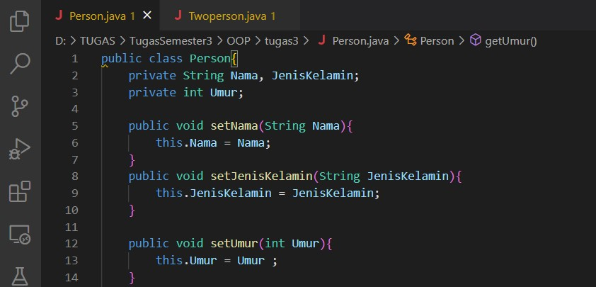
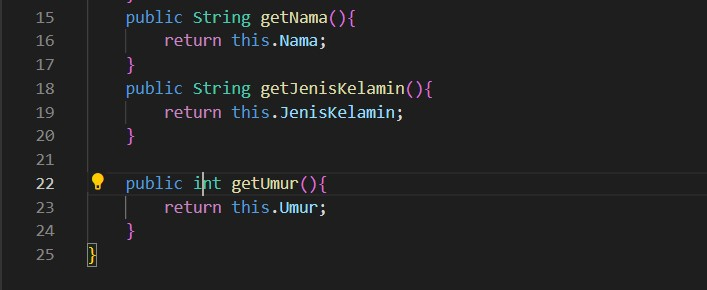
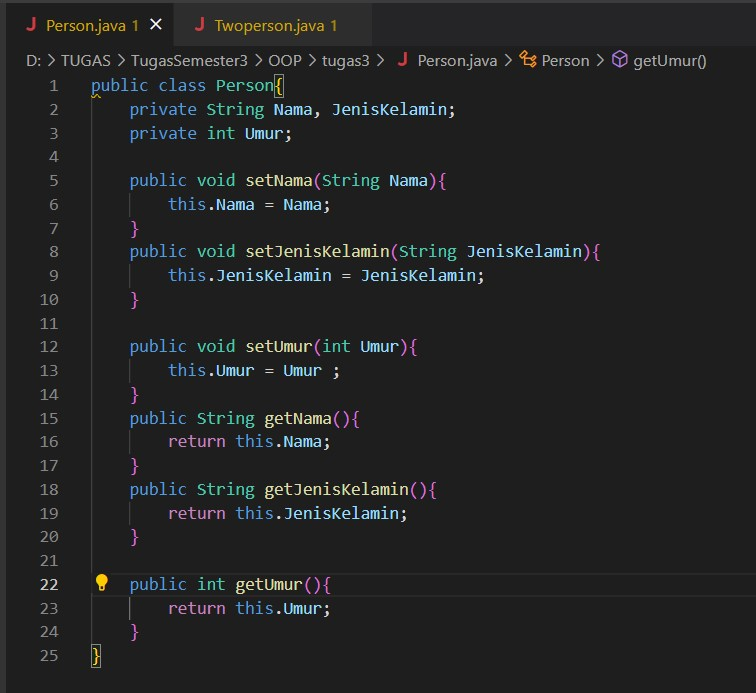
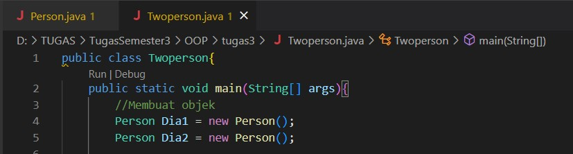
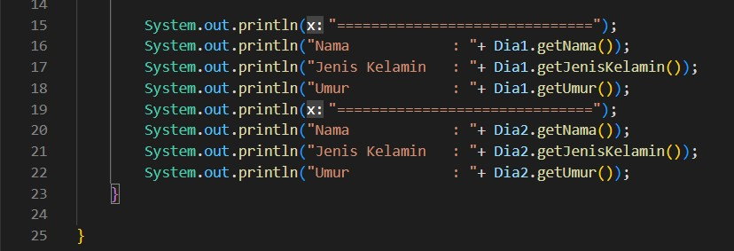
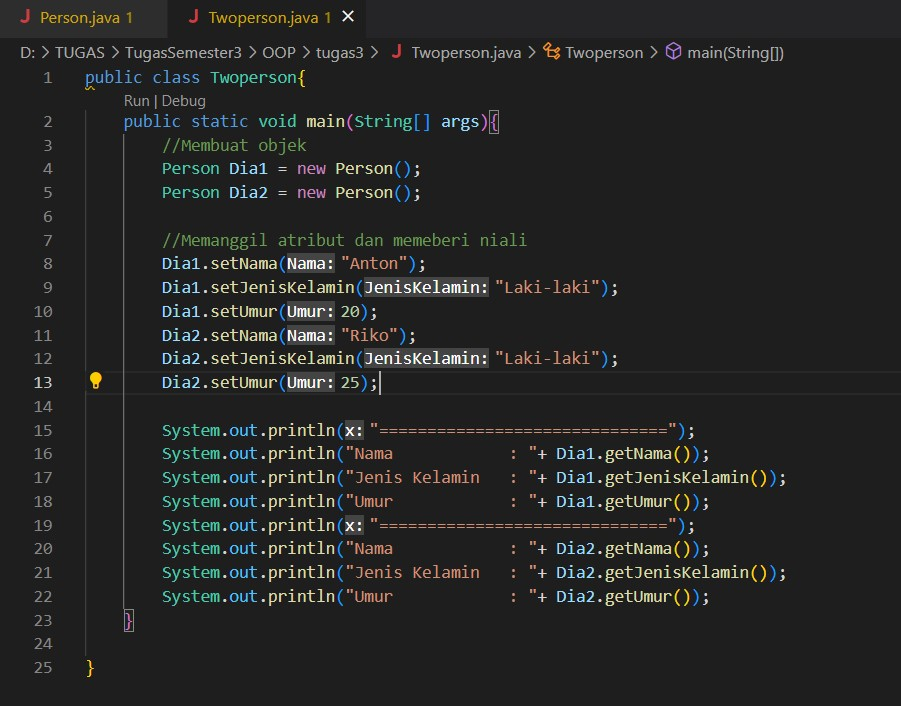
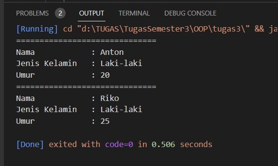

# Laporan Praktikum 2

1. Mendeklarasikan class Person, dengan atribut Nama, JenisKelamin, Umur dan lengkapi dengan access modifier.

2. Buatlah dua buah objek dari class Person bernama Anton dan Riko dan panggil method setter dan getter.

