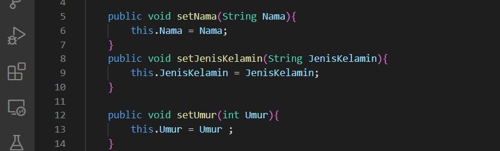

# Laporan Praktikum 2

Nama        : Imam Solehudin
Nim         : 312110290
Kelas       : TI.21.C.1
Mata Kuliah : Pemrograman Orientasi Objek

1. Mendeklarasikan class Person, dengan atribut Nama, JenisKelamin, Umur dan lengkapi dengan access modifier.
    - Untuk membuat class person yang memiliki atribut nama, jenis kelamin dan umur kita perlu type data string dan integer untuk umur. Pada class diagram ini kita menggunakan access modifier private, access modifier ini berfungsi untuk menjaga integritas data ketika ingin diakses objek lain. berikut programnya :
    

    
   - Selanjutnya kita tambahnakn method setter dan getter, method setter berfungsi untuk mengisi nilai pada variable dari class utama. berikut programnya :

   - Getter berfungsi mengambil nilai dari masing-masing variable pada class. berikut programnya :

   - Program keseluruhannya.

2. Buatlah dua buah objek dari class Person bernama Anton dan Riko dan panggil method setter dan getter.

    - Selanjutnya kita membuat 2 buah objek dalam class Person, objeknya yaitu Dia1 dan Dia2. berikut programnya :

   - Setelah membuat objek lalu kita membuat atribut dalam objek. Atributnya yaitu nama, jenis kelamin dan umur, pada saat membuat atribut kita juga memberikan nilai pada variable . breikut programnya :

   - Setelah membrikan nilai selanjutnya kita mengambil nilai dari variable dengan method getter. berikut programnya :

   - Berikut program keseluruhannya :

   - Hasil Program

