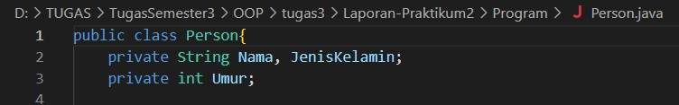

# Laporan Praktikum 2

1. Mendeklarasikan class Person, dengan atribut Nama, JenisKelamin, Umur dan lengkapi dengan access modifier.
    - Untuk membuat class person yang memilikia tribut nama, jenis kelamin dan umur kita perlu type data string dan integer untuk umur. Pada class diagram ini kita menggunakan access modifier private, access modifier ini berfungsi untuk menjaga integritas data ketika ingin diakses objek lain.
    

    
    - 

2. Buatlah dua buah objek dari class Person bernama Anton dan Riko dan panggil method setter dan getter.

